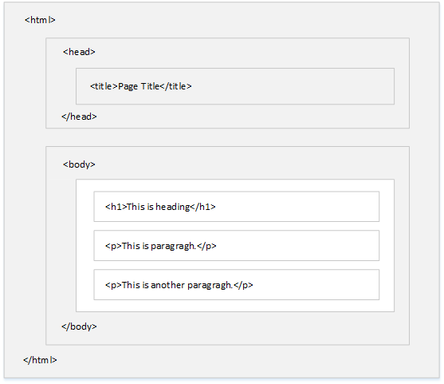

## 2.1 HTML简介

> 原文可查看[HTML Introduction](https://www.w3schools.com/html/html_intro.asp),[HTML Basic Examples](https://www.w3schools.com/html/html_basic.asp)

### 什么是HTML？

HTML是创建Web页面的标准标记语言。

- HTML是Hyper Text Markup Language的简写，表示超文本编辑语言
- HTML使用标记的方式描述了Web页面结构
- HTML元素是HTML页面的基本构建模块
- HTML元素使用标签表示
- HTML标签用于标记内容，如“标题”，“段落”等
- 浏览器不会显示HTML标签，而是使用它们呈现网页内容

### HTML标签

HTML标签通常使用`<>`括起来，其使用方式通常如下所示:

```html
<tagname>content goes here...</tagname>
```

- HTML标签通常都是成对出现的，如`<p>`和`</p>`；但是如果没有内容，也可以单独出现，如``
- 成对出现的标签中，内容之前的叫**开始标签**，内容之后的叫**结束标签**
- 结束标签和开始标签的区别在于其前面多了个**正斜杠**

### HTML文档的基本结构

HTML文档都有一个固定的文档格式，其中包括`<!DOCTYPE html>`，`<html>`，`<head>`，`<title>`和`<body>`

```html
<!DOCTYPE html>
<html>
    <head>
    	<title>Page Title</title>
    </head>
    <body>
        <h1>My First Heading</h1>
        <p>My first paragraph.</p>
    </body>
</html>
```

其网页结构可以如下所示，只有在`<body>`标签里的部分才能显示在浏览器中：



- `<!DOCTYPE html>` 用于定义文档类型，帮助浏览器正确显示网页。所有的HTML文档都必须定义文档类型，且只能出现一次，位于页面顶部，在任何HTML标签声明之前，不区分大小写。


- `<html>` 是HTML页面的根元素
- `<head>` 包含了文档中的所有meta信息
- `<title>` 指定文档标题
- `<body>` 包含了页面中的所有可见内容

### HTML版本

|  Version  | Year |
| :-------: | :--: |
|   HTML    | 1991 |
| HTML 2.0  | 1995 |
| HTML 3.2  | 1997 |
| HTML 4.01 | 1999 |
|   XHTML   | 2000 |
|   HTML5   | 2014 |

### HTML基本标签使用

- 标题，HTML中一共有`<h1>` - `<h6>` 6个等级的标题，字体大小依次递减。

- 段落，HTML中使用`<p>` 表示段落。

- 链接，HTML中使用`<a>` 表示链接，其中使用`href`属性来指定链接目标。

  ```html
  <a href="https://www.w3schools.com">This is a link</a>
  ```

- 图片，HTML中使用``显示图片，其中`src`属性指定图片源；`alt`属性指定描述性文字，用于图片无法查看时的替代方案；`width`和`height`属性指定图片的宽高。

  ```html
  
  ```

- 按钮，HTML中使用`<button>`显示网页中的按钮。

- 列表，HTML中使用`<ul>`指定无序列表，使用`<ol>`指定有序列表，其中用`<li>`来指定每一项内容。

  ```html
  <!--无序列表-->
  <ul>
    <li>Coffee</li>
    <li>Tea</li>
    <li>Milk</li>
  </ul>
  <!--有序列表-->
  <ol>
    <li>Coffee</li>
    <li>Tea</li>
    <li>Milk</li>
  </ol>
  ```